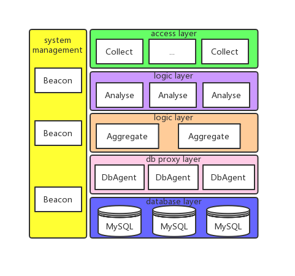
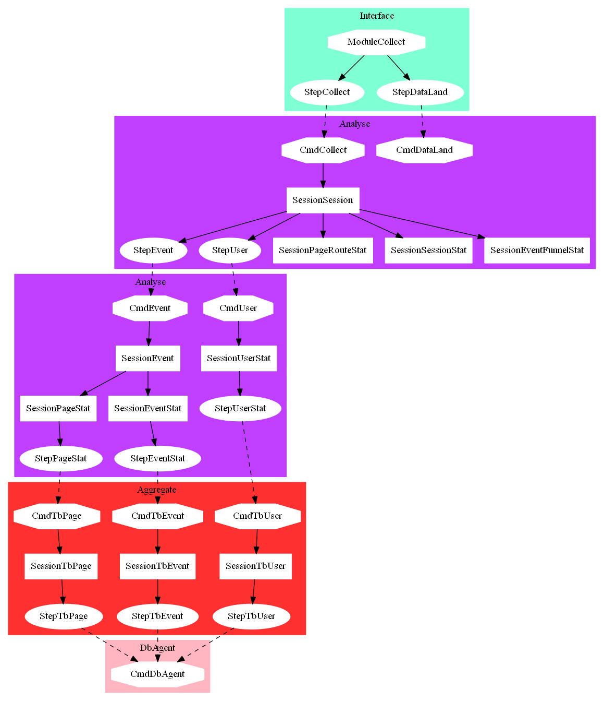

Nebio is a real-time analysis application based on the nebula network framework. 

nebio是一个基于nebula网络框架的数据实时统计分析应用。nebio集数据采集、数据落地、数据统计分析、分析结果入库等功能于一体。

架构图




数据流和统计活动图



[埋点数据上报协议](https://www.bwar.tech/2018/02/28/Collect.html)


Getting Start
``` bash
wget https://github.com/Bwar/NebulaBootstrap/archive/master.zip
unzip master.zip; rm master.zip; mv NebulaBootstrap-master Nebio
cd Nebio
mkdir build
cd build
wget https://github.com/Bwar/Nebio/archive/master.zip
unzip master.zip; rm master.zip; mv Nebio-master Nebio
cd ..
cp build/Nebio/deploy.sh ./
chmod u+x deploy.sh
./deploy.sh
```

